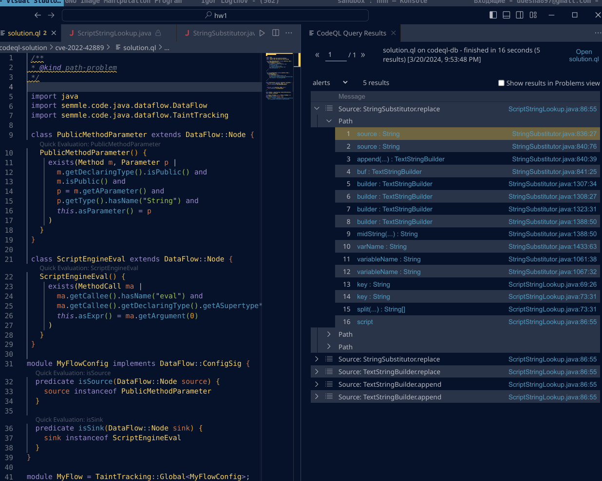
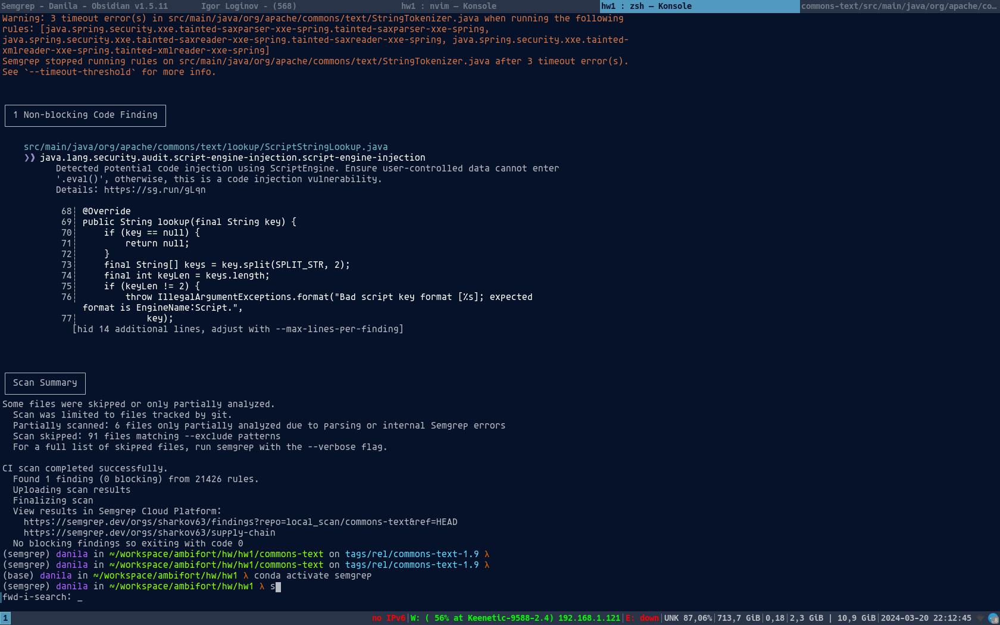
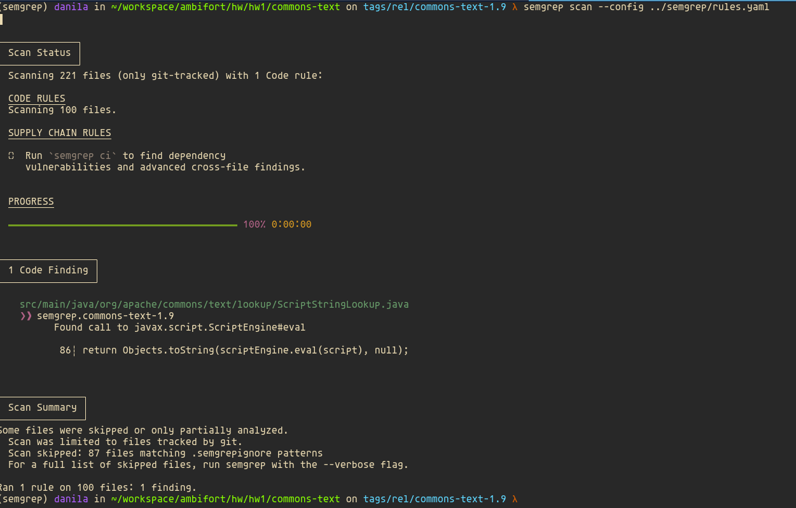

### Preparation
1. Checkout vulnerable revision
    ```sh
    git clone git@github.com:apache/commons-text.git
    git checkout rel/commons-text-1.9
    ```

# CodeQL pipeline
1. Create CodeQL database
    ```sh
    codeql database create --source-root ./commons-text -j 0 -l java ./codeql-db
    ```
1. Add database in VSCode window, then run query.
1. 

# Semgrep

## Interesting
`semgrep ci` found this potential code injection out of the box!

I am actually very impressed by this.

## Rule pipeline
* `semgrep scan --config ../semgrep/rules.yaml` - finds the call to `javax.script.ScriptEngine#eval`.
* 
* We cannot find this using taint analysis, because taint analysis in semgrep is intra-procedural

# joern

Taint-анализ от публичных методов публичных классов до "eval"
```
joern> val src = cpg.typeDecl.isPublic.method.isPublic.parameter
joern> val sink = cpg.call.name("eval").argument
joern> sink.reachableByFlows(src)
```
